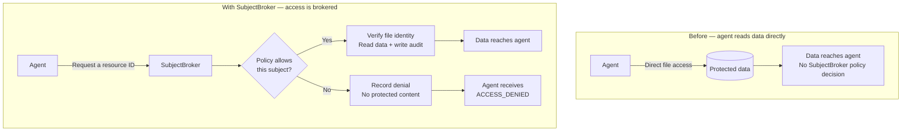

# SubjectBroker

[English](README.md) · [简体中文](README.zh-CN.md) · [繁體中文](README.zh-TW.md)

[](https://github.com/gexchai/subject-broker/actions/workflows/ci.yml)
[](LICENSE)

**SubjectBroker helps different AI agents see different data—even when they work in the same
project.**

SubjectBroker is an experimental subject-bound context broker with default-deny policy and
fail-closed auditing. The current prototype speaks the
[Model Context Protocol (MCP)](https://modelcontextprotocol.io/); the authority model is
protocol-independent.

> [!WARNING]
> SubjectBroker is an experimental macOS research prototype, not a production security boundary
> or an agent sandbox. An agent with direct filesystem, shell, network, browser, credential, or
> process access can bypass the broker. Use OS-level isolation to close those paths.

SubjectBroker is useful when multiple AI agents work against the same project and some registered
data should be reachable by only some of them. It is not a replacement for a sandbox.

Want to see it work first? [Jump to the quick start](#quick-start).

## SubjectBroker in plain English

Imagine several AI assistants working in the same environment. They should not automatically
receive the same data.

SubjectBroker places a controlled checkpoint in front of selected resources. Instead of asking
for a filesystem path, an agent asks for a registered name such as `design-doc`. Each
SubjectBroker process starts with a fixed subject, such as `orchestrator` or `worker`, and that
subject cannot be changed by the request.

For every brokered read, SubjectBroker checks a default-deny policy, verifies the registered
file, and writes a metadata-only audit event. Content is returned only if every required step
succeeds. A denied request—or an audit failure—returns no protected content.

SubjectBroker is not limited conceptually to secrets: the context being controlled could
represent a design document, customer record, knowledge source, or credential. The current
prototype implements this model for registered UTF-8 text files.

Three terms describe the model:

- **Subject** — the AI identity making the request, such as `orchestrator` or `worker`.
- **Resource** — registered data with a stable name, such as `design-doc`.
- **Policy** — the rules deciding which subject may read which resource.

For example, an `orchestrator` might be allowed to read `design-doc` but denied access to
`customer-records`. A `worker` can have a different view of the same project because it is
evaluated as a different subject.

## Why this exists

Agent frameworks often hand a subtask to a child agent while giving that child the parent's full
authority. If a parent can see both an orchestrator and worker MCP connection, a default child
may inherit both and gain their combined authority.

```text
Unsafe: one context holds both subjects       Safer: one visible subject per context

parent: orchestrator + worker                 orchestrator process: orchestrator only
└── child inherits both                       worker process: worker only
                                              └── descendants inherit worker only
```

SubjectBroker makes the MCP side of that boundary explicit:

- subject identity is fixed when the process starts;
- callers request registered resource IDs, never arbitrary paths;
- policy is default-deny;
- allowed content is released only after audit succeeds; and
- denial, error, and audit output exclude protected content.

### How the data path changes

SubjectBroker does not classify content or make decisions by topic. It changes how registered
resources are requested: the agent asks for a stable resource ID, and the process-bound subject
is evaluated before protected content can be returned.



An allow decision is not sufficient by itself: file verification, a bounded UTF-8 read, and the
metadata-only audit write must all succeed before content is released. A denied read records the
outcome and returns no protected bytes.

## Quick start

All current security, integration, and demo validation was performed on macOS. On other
platforms, the enforced read path and demo fail closed with `PLATFORM_UNSUPPORTED` rather than
claiming an unverified security boundary.

To run the current demo, install:

- Node.js 20 or newer; and
- npm.

```bash
git clone https://github.com/gexchai/subject-broker.git
cd subject-broker
npm ci
npm run demo
```

Expected result:

```text
SubjectBroker subject-bound read demo

orchestrator → {"decision":"allow","reasonCode":"ALLOWED","resourceId":"secret","content":"SUBJECT_BROKER_DEMO_SECRET\n"}
worker       → {"decision":"deny","reasonCode":"ACCESS_DENIED","resourceId":"secret"}

Both outcomes were written to separate metadata-only audit logs.
```

The demo creates a temporary protected resource and one policy, then starts two broker instances
bound to different subjects. It cleans up its temporary files on exit. The integration test suite
separately exercises the complete MCP stdio transport.

Run the full unit, integration, and security test suite:

```bash
npm test
```

## Implemented safeguards

The implemented macOS path includes:

- process-level subject binding;
- strict policy parsing and default-deny evaluation;
- registered resource IDs instead of caller-supplied paths;
- symlink, replacement, and file-identity checks;
- bounded strict UTF-8 reads;
- fail-closed audit semantics;
- non-sensitive denial and startup diagnostics; and
- a capability report that names covered and uncovered paths.

## Field-tested agent behavior

These are version-pinned integration results, not universal claims about future releases.

| Harness | Observed delegation behavior | Supported distinct-subject topology |
| --- | --- | --- |
| Claude Code 2.1.220 | Default subagents inherited parent MCP authority | Persistent named custom subagent with an explicit MCP `tools` allowlist |
| Codex CLI 0.144.4 | Native children inherited parent MCP connections | Separate process and `CODEX_HOME`, with one subject connection per profile; tested through depth 2 |
| Hermes Agent 0.19.0 | Native delegation inherited the profile's connections | Separate top-level process/profile per subject |
| Pi 0.82.1 | No native subagent mechanism in the tested release | Separate single-subject process; direct-read enforcement still requires a sandbox |

See the [Claude Code](docs/integration-claude-code.md),
[Codex](docs/integration-codex.md), [Hermes](docs/integration-hermes.md), and
[Pi](docs/integration-pi.md) integration notes for the exact boundaries.

## Run as an MCP server

Build the server:

```bash
npm run build
```

Create a policy using absolute paths:

```yaml
version: 1
storageRoot: /absolute/path/to/protected-storage
subjects:
  - orchestrator
  - worker
resources:
  contract:
    path: /absolute/path/to/protected-storage/contract.txt
rules:
  - subject: orchestrator
    resource: contract
    action: read
    decision: allow
  - subject: worker
    resource: contract
    action: read
    decision: deny
```

Start one process for one subject:

```bash
node dist/server.js \
  --policy /absolute/path/to/subject-broker.yaml \
  --subject worker \
  --audit /absolute/path/to/subject-broker-worker-audit.jsonl \
  --max-bytes 1048576
```

The stdio server exposes exactly:

- `list_resources`
- `read_resource`
- `explain_decision`
- `capability_report`

`--max-bytes` defaults to 1 MiB. Policy and registered file identity are pinned at startup.
Restart after an authorized resource replacement; a changed file identity returns
`RESOURCE_CHANGED`.

The audit destination must be a regular owner-only (`0600`) file and must not be a symlink. If
validation or writing fails, content is not released.

## Detect cross-subject retries

The offline checker flags one observed escalation pattern: a deny for one subject followed by an
allow for a different subject on the same resource within a configured window.

```bash
npm run audit:check -- \
  --window-seconds 10 \
  /absolute/path/to/audit-worker.jsonl \
  /absolute/path/to/audit-orchestrator.jsonl
```

Exit code `0` means no match, `2` means one or more suspicious matches, and `1` means invalid
arguments or audit input.

This is a heuristic detective control. It may flag legitimate concurrency and cannot detect a
privileged-first call. A `clear` result does not prove safe delegation.

## What SubjectBroker does not do

SubjectBroker does not currently provide:

- OS sandboxing or mandatory routing through the broker;
- protection from direct filesystem, shell, network, browser, clipboard, credential, or process
  access;
- encryption, redaction, classification, search, or write operations;
- a daemon or cloud control plane; or
- a guarantee that third-party agent frameworks isolate their own delegated contexts.

The central deployment invariant is:

> Every agent context must see only the SubjectBroker connection for its assigned subject.

If one context can see multiple subject-bound connections, its effective authority is their
union. The broker cannot repair that configuration from inside a third-party harness.

## Evidence

- [Threat model](THREAT_MODEL.md)
- [Architecture decisions](DECISIONS.md)
- [Questions answered and still open](QUESTIONS.md)
- [Multi-agent field evidence](docs/field-evidence-2026-07-28.md)
- [Public evidence minimization policy](results/README.md)
- [Claude Code confirmation results](results/claude-code-confirmation/RESULTS.md)
- [Codex confirmation results](results/codex-confirmation/RESULTS.md)

Published field evidence is minimized to relevant actor relationships, tool events, prompts,
normalized configuration, and broker audits. Raw account, machine, plugin, session, request,
thinking-signature, and unrelated provider metadata are not published. Source-artifact SHA-256
hashes are retained for provenance.

## Project status

Status: **experimental, working, attack-tested spike**.

SubjectBroker was developed under the former working name **ContextGuard**. Dated architecture
decisions and retained field evidence preserve that name where changing it would rewrite the
historical record.

The policy schema and behavior may change. Only entries marked `decided` in
[DECISIONS.md](DECISIONS.md) describe deliberate choices for this spike. Before production use,
the direct-read path requires an independently verified OS sandbox and a fresh security review.

See [CONTRIBUTING.md](CONTRIBUTING.md) before proposing a change. Potential vulnerabilities
should follow the private-reporting guidance in [SECURITY.md](SECURITY.md).

Licensed under the [Apache License 2.0](LICENSE).
